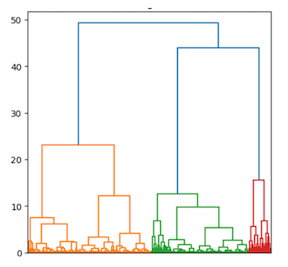

# About Me

Over 20 years of Corporate Finance and Capital Markets experience.   Long history of developing and executing complex strategic and financing solutions for corporate clients.  Leadership experience building multiple businesses.   

## Education

Master of Applied Data Science - University of Michigan

Master of Business Administration - University of Chicago

Bachelor of Arts - Northwestern University

# Select Data Science Projects

## Can Natural Language Processing Be Used To Enhance Investment Returns?

- Analyzed whether an investment portfolio including signals derived from NLP algorithms could outperform trading strategies based solely on traditional technical indicators
- NLP algorithms used Federal Open Market Committee Meeting Minutes from 2008 through June of 2023 as inputs
- Compared returns of traditional 60/40 equity/debt portfolio vs. combinations of 11 equity and 4 debt ETFs 
- Result:  Certain NLP-optimized ETF portfolios delivered superior risk-adjusted returns vs. traditional 60/40 equity/debt benchmark
  
### Illustrative Named Entity Recognition Analysis

  
## eCommerce Analysis - Using ML to Enhance Marketing Strategies

- Analyzed over 875,000 web transaction events of an online electronics retailer with over 53,000 products in 700 categories
- Used supervised learning models and both traditional and web-based marketing metrics to predict the likelihood of purchasing a  given product 
- Used unsupervised models to segment customers into 3 clusters.  Created distrinct personas which can be used to enhance the effectiveness of targeted marketing campaigns

### Supervised Feature Importance Analysis - Video Cards
#

### Unsupervised Clustering Analysis and Dendogram
|

## Choosing A Location For A New International Manufacturing Facility  
- Analyzed World Development Index dataset from the World Bank in order to make a recommendation for a new manufacturing facility of a hypothetical multinational corporation
- Dataset contains over 1,400 time series indicators for over 200 countries
- Compared 18 countries across 3 regions -- Southeast Asia, Africa and Eastern Europe
- Recommendation based on Economic, Demographic and Human Rights indicators
  

 
## Is The Playing Field Level?

- Analyzed distribution of star rankings awarded to top high school football players compared to the U.S. distribution of income
- Goal was to determine whether high school players from wealthier backgrounds receive a disproportionate share of top rankings based on access to private coaching and camps
- Results show that certain positional groups (Quarterbacks and Offensive Linemen) tend to be overrepresented by prospects from wealthier backgrounds

### Distribution Based On Income Quartiles

