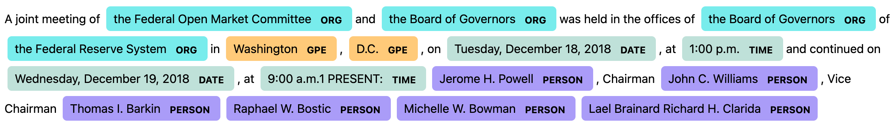

# Data Science | Corporate Finance | Capital Markets

## Education

Master of Applied Data Science - University of Michigan (2023)

Master of Business Administration - University of Chicago

Bachelor of Arts - Northwestern University

# Select Data Science Projects

## Can Natural Language Processing Be Used To Enhance Investment Returns?

- Optimized portfolio of debt and equity ETFs using a combination of traditional technical indicators and NLP
- Performed multiple NLP analyses on Federal Open Market Committee Meeting Minutes from 2008 through June of 2023
- NLP-optimized portfolio delivered superior risk-adjusted returns

  
## eCommerce Analysis - Using ML to Enhance Marketing Strategies

- Used machine learning models to analyze web transaction data of online electronics retailer
- Supervised learning models used on traditional and web-based marketing metrics to assess likelihood of purchasing specifics products
- Unsupervised models to segment customer base and develop personas that could enhance the effectiveness of targeted marketing campaigns

## Choosing A Location For A New International Manufacturing Facility  
- Analyzed World Development Index dataset from the World Bank in order to make a recommendation for a new manufacturing facility of a hypothetical multinational corporation
- Recommendation based on Economic, Demographic and Human Rights indicators
 
## Is The Playing Field Level?

- Analyzed distribution of star rankings awarded to top high school football players compared to the U.S. distribution of income
- Goal was to determine whether high school players from wealthier backgrounds received a disproportionate share of top rankings
- Results show that certain positional groups (Quarterbacks and Offensive Linemen) tend to be overrepresented by prospects from wealthier backgrounds

#- 

##  Work Experience

# ADD PICTURE

# Picture

